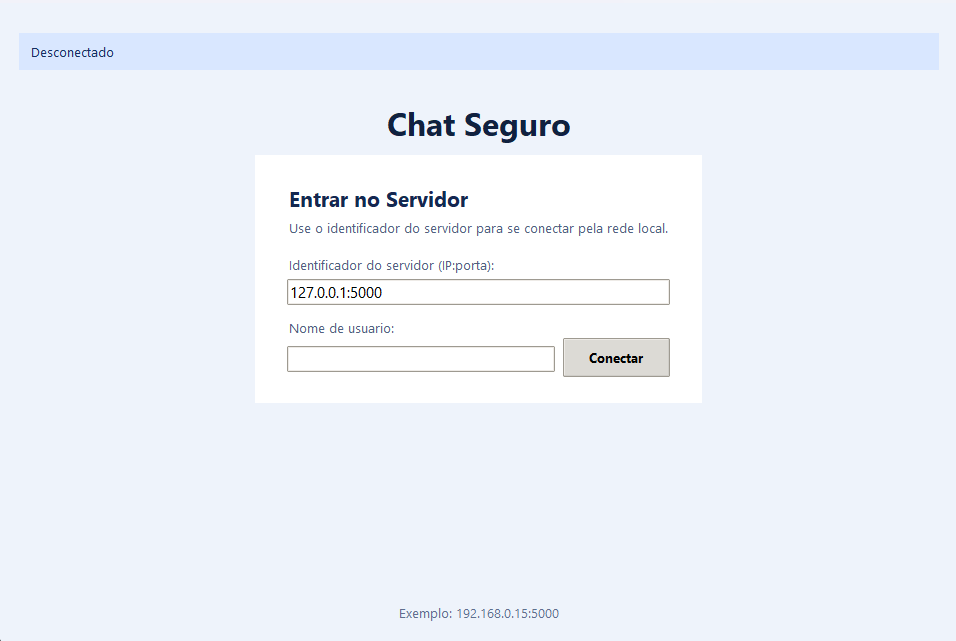
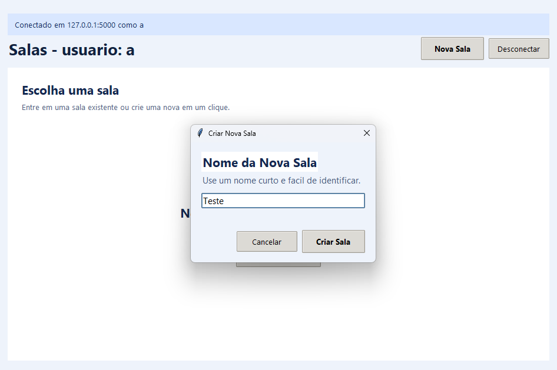
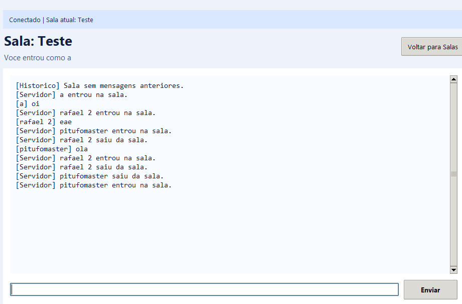

# Chat Seguro Cliente-Servidor (Python)

Aplicacao de chat em arquitetura cliente-servidor, com sockets TCP, criptografia de mensagens em transito e persistencia de salas/historico no servidor.

Este projeto foi implementado para a atividade avaliativa de Redes de Computadores, cobrindo os pontos tecnicos exigidos: socket, comunicacao funcional, criptografia, organizacao e documentacao.





GRUPO : Rafael , Isabella , Lucas Bueno e Muryllo 


## Visao geral

O sistema possui:

- Servidor TCP multicliente com threads.
- Cliente grafico (Tkinter) com fluxo em 3 telas:
1. Login (usuario + identificador do servidor)
2. Lobby (lista de salas + criar/entrar)
3. Chat da sala (mensagens + historico)
- Mensagens do chat trafegando criptografadas.
- Persistencia local no servidor:
1. salas em `storage/rooms.json`
2. historico criptografado por sala em `storage/history/*.jsonl`

## Requisitos

- Python 3.10+
- Sem dependencias externas (somente biblioteca padrao)

## Estrutura do projeto

```text
.
|- client.py
|- server.py
|- protocol.py
|- crypto_utils.py
|- storage/
|  |- rooms.json
|  |- history/
|     |- .gitkeep
|- README.md
|- .gitignore
```

## Como executar (rapido)

Abra 2 terminais na raiz do projeto.

### 1) Subir o servidor

```bash
python server.py --host 0.0.0.0 --port 5000 --key "minha-chave-secreta"
```

### 2) Abrir cliente

```bash
python client.py --host 127.0.0.1 --port 5000 --key "minha-chave-secreta"
```

### 3) Fluxo no cliente

1. Informe `IP:porta` do servidor.
2. Informe o nome de usuario.
3. Entre em uma sala existente ou clique em `Nova Sala`.
4. Converse normalmente no chat.

## Conectar outro PC na mesma rede

1. Rode o servidor com `--host 0.0.0.0`.
2. O servidor exibira IPs locais (ex.: `192.168.1.20:5000`).
3. No outro PC, execute:

```bash
python client.py --key "minha-chave-secreta"
```

4. No login do cliente, preencha o identificador `IP:porta` mostrado no servidor.

Se nao conectar:

1. Verifique se ambos os PCs estao na mesma rede.
2. Verifique se a porta TCP (ex.: `5000`) esta liberada no firewall da maquina servidora.
3. Verifique se a chave (`--key`) e exatamente igual em servidor e clientes.

## Arquitetura tecnica

### `server.py`

Responsabilidades:

- Aceitar multiplos clientes via TCP.
- Controlar sessoes, salas e usuarios online.
- Encaminhar mensagens por sala (broadcast).
- Persistir salas e historico.
- Enviar historico recente ao entrar na sala.

Comandos de protocolo tratados:

- `hello`
- `list_rooms`
- `create_room`
- `join_room`
- `leave_room`
- `message`

### `client.py`

Responsabilidades:

- Interface grafica (Tkinter).
- Conexao com servidor e escuta assicrona (thread).
- Lobby com lista ordenada de salas e quantidade de usuarios.
- Modal de criacao de sala.
- Renderizacao de historico ao entrar na sala.

### `protocol.py`

Protocolo de transporte com framing manual:

1. serializa pacote para JSON UTF-8
2. prefixa com 4 bytes (big-endian) do tamanho
3. envia em socket TCP

Isso evita quebra de mensagens por fragmentacao do TCP.

### `crypto_utils.py`

Criptografia didatica com chave compartilhada:

1. `K = SHA256(shared_secret)`
2. `nonce` aleatorio por mensagem
3. stream de bytes gerado por blocos SHA-256 com contador
4. `ciphertext = plaintext XOR keystream`
5. `tag = HMAC-SHA256(K, nonce || ciphertext)`

Formato trafegado:

```json
{
  "nonce": "...",
  "ciphertext": "...",
  "tag": "..."
}
```

Observacao importante:

- O servidor valida autenticidade/integridade, mas nao exibe mensagem em claro no log.
- O texto so aparece legivel no cliente.

## Persistencia

### Salas (`storage/rooms.json`)

- Toda sala criada e registrada.
- Ao reiniciar servidor, salas sao carregadas novamente.
- Salas aparecem no lobby mesmo com `0` usuarios online.

### Historico (`storage/history/*.jsonl`)

- Cada sala possui arquivo proprio (nome derivado de slug + hash da sala).
- Cada linha do arquivo e um JSON com:
1. `ts` (timestamp UTC)
2. `sender`
3. `payload` criptografado (`nonce/ciphertext/tag`)

Quando um cliente entra na sala, o servidor envia historico recente para exibicao.

## Protocolo de mensagens (resumo)

Cliente -> Servidor:

- `{"type":"hello","name":"Rafael"}`
- `{"type":"list_rooms"}`
- `{"type":"create_room","room":"Sala de teste"}`
- `{"type":"join_room","room":"Sala de teste"}`
- `{"type":"leave_room"}`
- `{"type":"message","payload":{...criptografado...}}`

Servidor -> Cliente:

- `hello_ack`
- `room_list`
- `joined_room`
- `room_history`
- `broadcast`
- `left_room`
- `error`

## Boas praticas e limites

- Projeto didatico para disciplina.
- Nao substitui TLS nem criptografia de producao.
- Para ambiente real, usar TLS e bibliotecas criptograficas auditadas (ex.: AES-GCM em libs consolidadas).

## Troubleshooting

### 1) Cliente nao conecta

- Confirme `IP:porta` no login.
- Confirme chave igual em todos os lados.
- Confirme firewall liberando a porta do servidor.

### 2) Sala nao aparece

- Clique em `Atualizar` no lobby.
- Verifique se `storage/rooms.json` esta acessivel no servidor.

### 3) Historico nao carrega

- Verifique se existem arquivos em `storage/history/`.
- Verifique se a chave esta correta (chave errada invalida descriptografia).

### 4) Erro de socket ao desconectar (Windows)

- O cliente ja trata desconexao voluntaria para evitar popup indevido.
- Se aparecer erro, feche e abra cliente novamente.

## Mapeamento rapido para criterios da atividade

- Socket implementado manualmente: `server.py`, `client.py`, `protocol.py`
- Comunicacao cliente-servidor funcional: login, salas, chat
- Criptografia implementada: `crypto_utils.py` + validacao no servidor
- Organizacao de codigo: modulos separados por responsabilidade
- Documentacao: este README
- Publicacao: projeto pronto para subir no GitHub
